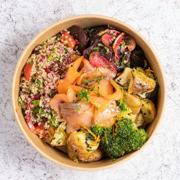
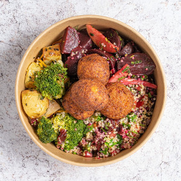
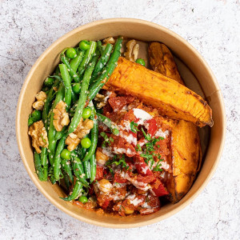
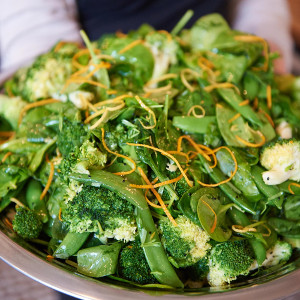
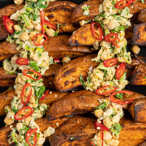
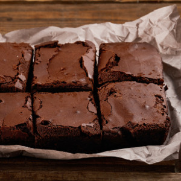
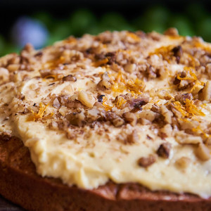
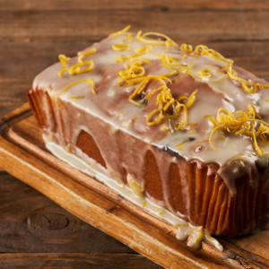
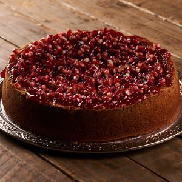
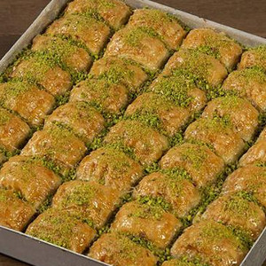

**All food and refreshments are free to ticket-holders.**  

## Refreshments

### Hot drinks

A staffed coffee bar will be available from 09:00 to 16:00 serving:

- Barista-made coffee
- A range of teas
- Hot chocolate
- Dairy and non-dairy milk

_The coffee bar is operated by [Coffee Geek and Friends](http://www.coffeegeekandfriends.co.uk/)._

### Cold drinks

- Water

## Breakfast Snacks

- **Granola (V, GF, H)**  
  _Gluten free granola with natural greek yoghurt, homemade seasonal fruit compote & honey._  
  Allergens: Milk

- **Fruit Pot (V, VE, GF, DF, H)**  
  _Chopped seasonal fruit pot_

- **Mixed Pastries (V)**  
  _A selection of artisan pastries. All butter croissant, pain au chocolate & pain au raisin._  
  Allergens: Gluten, Eggs, Milk, Wheat (Gluten)

_The breakfast snacks are being catered by [Route Catering](https://routecatering.co.uk/)._

## Lunch
We will be providing a choice of "boxed" lunches with a selection of extra salads and deserts. We have tried to cater for most dietary requirements.

_The lunch is being catered by [Route Catering](https://routecatering.co.uk/)._

### Key
V - Vegetarian  
VE - Vegan  
GF - Gluten Free  
DF - Dairy Free  
H - Halal

### Main options

- **Smoked Salmon Lunchbox (GF, DF, H)**  
  
  _Assortment of three salads topped with Smoked Salmon. Salads consist of Baby Potato salad, Beetroot salad & Quinoa salad_  
  Allergens: Fish, Celery and celeriac, Mustard, Sesame, Sulphur

- **Vegan Lunchbox (V, VE, DF, H)**  
  
  _Assortment of three salads topped with Vegan Kofte Balls. Salads consist of Baby Potato salad, Beetroot salad & Quinoa salad_  
  Allergens: Gluten, Celery and celeriac, Mustard, Sesame, Sulphur, Wheat (Gluten)

- **Roasted Sweet Potato Hot Box (V, VE, GF, DF, H)**  
  
  _Roasted sweet potato topped with chickpeas salsa and tahini, served with Broccoli salad_  
  Allergens: Sesame, Sulphur

### Extra salad selection

- **Broccoli & Sugar Snaps Salad (V, VE, GF, DF, H)**  
  
  _Broccoli, sugar snap, baby spinach, orange zest, black sesame, dill, white wine vinegar, orange juice, salt, pepper, lemon juice, olive oil_  
  Allergens: Sulphur

- **Sweet Potato Salad (V, VE, GF, H)**  
  
  _Roasted Sweet Potato topped with Chickpeas & Tahini (Sesame), spring onion, balsamic glaze, red chilli, paraley, salt, pepper, lemon juice, olive oil_  
  Allergens: Sesame

### Desert

- **Chocolate Brownie (V)**  
  
  Allergens: Gluten, Eggs, Milk, Nuts

- **Carrot & Walnut Cake (V)**  
  
  _with buttercream & orange zest_  
  Allergens: Gluten, Eggs, Milk, Nuts

- **Lemon & Blueberry Cake (VE, V, DF)**  
  
  _with lemon zest and glaze._  
  Allergens: Gluten

- **Orange & Pomegranate Cake (V, GF)**  
  
  Allergens: Eggs, Milk, Nuts

- **Baklava (V, VE, DF, H)**  
  
  Allergens: Gluten, Nuts

---

_If you feel that your dietary requirements have not been met by the above catering, drop us an email at <us@ukhealthcamp.com> and we'll see what we can do to make sure you're sorted on the day 😃_

_Photos are indicative from the [Route Catering](https://routecatering.co.uk/) menu_
