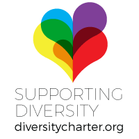

{::options parse_block_html="true" /}

# UK Health Camp
The free ‘unconference’ for everyone interested in digital, design, technology and data for health and care.

**Saturday 14th September  
Office for National Statistics, Newport, Wales     
[#ukhc19](https://twitter.com/search?q=%23ukhc19)**

<tito-button class="get-tickets" event="ukhealthcamp/2019" ssl-check-disabled>
    <a href="https://ti.to/ukhealthcamp/2019" class="btn btn-success">Get Tickets</a>
</tito-button>

_See this **[blog post](/blog/2019/uk-health-camp-2019)** for full ticket release schedule._

 
<form action="//ukhealthcamp.us11.list-manage.com/subscribe/post?u=d6e1cdf0510d674a480518c55&amp;id=359b65b939" method="post">
<label class="sr-only" for="mce-EMAIL">Email address</label>
<input type="email" name="EMAIL" id="mce-EMAIL" placeholder="Your email address">
<button type="submit" class="btn btn-info" name="subscribe" id="mc-embedded-subscribe">Join mailing list</button>
</form>

[Twitter](https://twitter.com/UKHealthCamp){:class="logo twitter"}
[GitHub](https://github.com/UKHealthCamp){:class="logo github"}

<!--

[Sponsor Us &raquo;](/sponsorship){:class="btn btn-white"}

-->

## What is UK Health Camp?
There are lots of brilliant things happening to make health and care services better for patients, carers, and professionals.

**Our aim is to provide a space to connect, share ideas and make things happen.**

This isn't the first Health Camp - [similar events](https://en.wikipedia.org/wiki/HealthCamp) have been held in other countries and in the UK in 2015, 2017, and 2018.

**We are open to all**, whether you work for health and care services or not.

Our events are multidisciplinary - we aim to bring together health and care professionals, policy makers and service managers together with designers, digital specialists and technologists. Everyone is welcome.

We believe that diversity at conferences and events is important and support the **[Diversity Charter](https://diversitycharter.org/)**.  

{:class="centre"}
  

**We have a [Code of Conduct](/code-of-conduct)** and ask for cooperation from all participants to help ensure a safe environment for everybody at UK Health Camp.

## How does it work?
If you've never been to an [unconference](https://en.wikipedia.org/wiki/Unconference), **Don't Panic**.

Instead of a schedule arranged ahead of time featuring presentations and panels brought to you by the great and the good, **everyone in the room gets to help design the agenda for the day** as the first order of business.

We invite all attendees to propose ideas and topics that they would like to discuss, then with a brief flurry of concentration, post-its and pragmatism we arrange these into a [session grid](https://twitter.com/puntofisso/status/914074219998269440) (schedule). 

**Sessions should bias strongly towards being discursive** rather than a talk from a single person. Think seminar rather than lecture, more socratic than didactic.

This way, we turn the conversations that happen in the hallway, in between sessions at most conferences into the main event. You'll grow your network with passionate and clueful people, and get to jump in and join the party.

**Like our sister [BarCamp](http://barcamp.org)-style events [UKGovcamp](http://www.ukgovcamp.com) and [LocalGovCamp](http://localgovdigital.info/localgovcamp/)**.

Come and join us. **Don't panic!**

### Previous sessions

To give you a taste of the kinds of things that come up, examples of previous sessions at UK Health Camp include:

- How do we improve patient education?
- Clinicians trying to influence informatics
- Code that makes space for care
- Digitising maternity
- Health + Social Care integration
- Dynamic systems modelling
- "Let's (politely) argue about personal data"
- Project failures: lessons learnt and shared
- Social prescribing
- Developing the digital workforce
- Digitising consent
- GP Paperless Practice opportunities & challenges
- What do we know?

You can see the full list of sessions from UK Health Camp 2017 here: [UK Health Camp 2017 Sessions](https://docs.google.com/spreadsheets/d/14FVFi-82xhQgJpUsZKnKbmLxlOJTTTyed2wKy6O32XI)

## UK Health Camp 2019 Schedule

**Saturday 14th September 2019**  
09:00 - Doors open / registration  
10:15 - Pitching and planning   
11:30 - Session 1  
12:20 - Session 2  
13:00 - Lunch  
14:00 - Session 3  
15:00 - Session 4  
15:50 - Session 5  
16:45 - Wrap-up and closing address  
17:00 - Close

From 17:00 onwards **sponsored drinks** will be available nearby for anyone who'd like to continue the conversation!

## Our supporters from UK Health Camp last year (2018)


<!--
Want to sponsor UK Health Camp 2019? Email <sponsors@ukhealthcamp.com>

[Sponsor Us &raquo;](/sponsorship){:class="btn btn-danger btn-sponsor"}
-->

## How can I get involved?
UK Health Camp is run entirely by volunteers. The 2019 event is being organised by [@thatdavidmiller](https://twitter.com/thatdavidmiller), [@puntofisso](https://twitter.com/puntofisso), [@DeckOfPandas](https://twitter.com/deckofpandas), [@mattstibbs](https://twitter.com/mattstibbs), [@cholten99](https://twitter.com/cholten99), [@Rozalie_Horka](https://twitter.com/Rozalie_Horka), and [@blu3id](https://twitter.com/blu3id).

There are several ways to help us put on UK Health Camp:
- Volunteer as an organiser.
- Donate money or resources.
- Attend UK Health Camp and participate (sign up at the top of this page).
- Spread the word on social media - [@UKHealthCamp](https://twitter.com/UKHealthCamp) [#ukhc19](https://twitter.com/search?q=%23ukhc19)
- Print off a poster to put in your office/surgery/ward/toilet ([one colour](branding/posters/2019/poster_mono.pdf), [two colours](branding/posters/2019/poster_twocolours.pdf))

**If you can help us, please email <sponsors@ukhealthcamp.com>.**

<!--
[Sponsor Us &raquo;](/sponsorship){:class="btn btn-danger btn-sponsor"}
-->

{::comment}
    The following is JSON Linked Data this provides Structured Data about the UK
    Health Camp 2018 event so that Google (and other search engines, social media
    sites etc.) can provide appropriate enhancements and links on the results pages.
    For more information and documentation see:
    https://developers.google.com/search/docs/guides/intro-structured-data,
    https://schema.org/Event and https://json-ld.org/
{:/comment}

